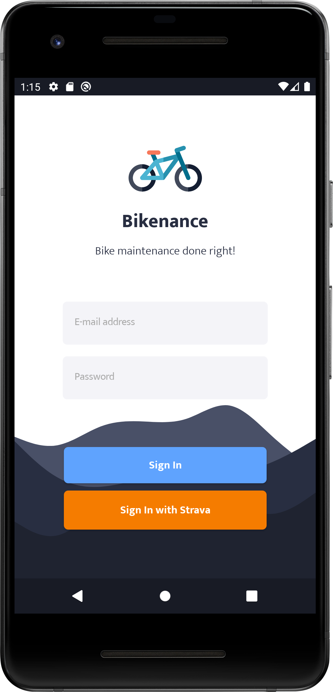
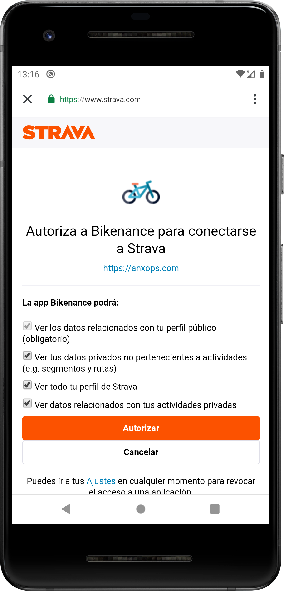
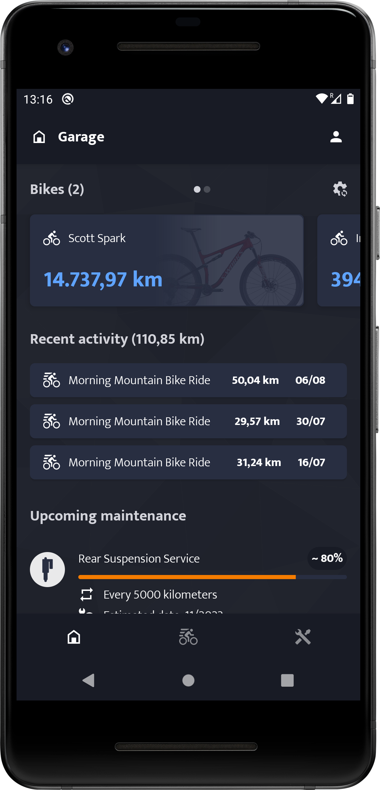
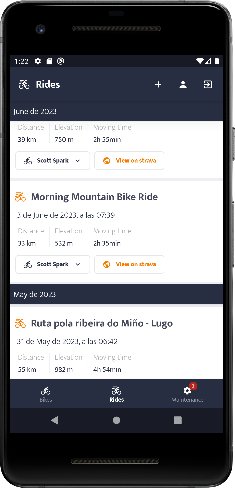
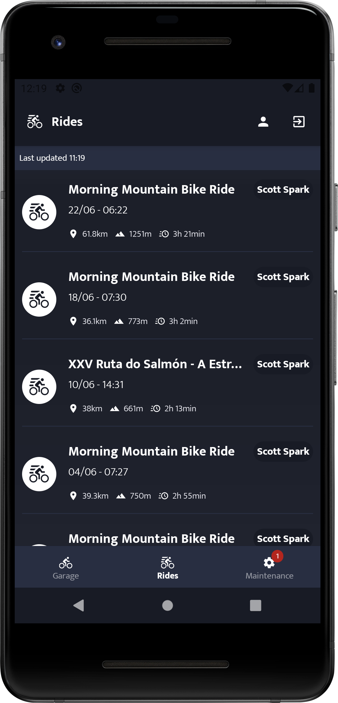

# 🚴‍ Bikenance

Bikenance is an Android application that allows you to keep complete control over bike and component maintenance. With Bikenance, you can register your bikes, manage components, track maintenance, and receive reminders to keep your bikes in optimal condition. The app features seamless integration with Strava, a popular platform for tracking cycling activities.

**This is an ongoing learning project** that I build to explore and enhance my programming skills and try new stuff. There may be changes or updates made at any time without prior notice.

Below you can see some screenshots of some parts off the app already developed.

|  |  |  |  |  |  |
|:--------:|:--------:|:--------:|:--------:|:--------:|:--------:|

## Key Features

- Strava Integration: Bikenance seamlessly integrates with Strava, allowing you to leverage your activity data for enhanced maintenance tracking.

- Bike Registration: Register your bikes in the app, including details such as name, model, and technical specifications for each bike. Import bikes from Strava to streamline the process.

- Component Management: Manage the components of your bikes, such as forks, wheels, brakes, chains, etc. Record details such as the brand, model, and installation date for each component. Associate components with your Strava-imported bikes.

- Maintenance Tracking: Keep a detailed maintenance history for each component. Record repairs, part replacements, adjustments, and other maintenance tasks performed. Activity data from Strava updates component mileage and usage hours.

- Maintenance Reminders: Receive notifications and reminders when maintenance or component replacement is due based on accumulated mileage and usage hours. Futore smart calculations will take into account your Strava activity parameters like avg power, or climatological data.

## Roadmap

### MVP Version

The MVP version of Bikenance will focus on the following functionalities:

- Strava integration
    - Login with strava
    - Import user profile and bikes from Strava
    - Keep track of user rides
    - Display user rides
- Bike components registration.
- Basic maintenance tracking based on mileage and usage hours.
- Maintenance reminders based on accumulated mileage and usage hours.

### Future versions

- 📄 Invoice and Note Storage: Allow users to store invoices and notes related to repairs carried out at specialized stores.

- 📏 Biomechanical Measurements and Customizations: Provide a space to store biomechanical measurements, such as saddle height, handlebar distance, etc. This will facilitate bike adjustments in case of changes or necessary modifications.

- 🧠 Intelligent Wear Calculation
    - Utilize activity parameters from Strava to weigh component wear. These parameters may include terrain type, weather conditions, and activity intensity.
    - Dynamic Wear Thresholds: Over time, the app analyzes the user's maintenance history to determine personalized wear thresholds for each component. If a component consistently wears out before the initially suggested threshold, the app adjusts the threshold accordingly for future maintenance notifications.

## Architecture

Bikenance utilizes a client-server architecture, with a mobile app for Android and a backend server.

### Android App

Technologies used in the Android app:
- Jetpack Compose for modern UI development.
- Room, Hilt, ViewModel, Coroutines, and other Android Jetpack Libraries.
- Push Notifications: Firebase Cloud Messaging (FCM) for delivering push notifications.

### Backend Server

The Bikenance backend server comprises the following components and technologies:

- Language: Kotlin
- Framework: Ktor, a flexible and asynchronous web framework for building server applications.
- Database: MongoDB, a NoSQL database used to store user profiles, bike data, and activity information.
- API Integration: Utilizes the Strava API to authenticate users, retrieve bike data, and receive activity information.

### Flow of Information

The flow of information involves the app, the Bikenance server, and Strava. Let's dive into the details:

1. User Authentication:
    - Users log in to the Bikenance mobile app using OAuth with Strava. The app requests authorization from the Strava API, and upon successful authentication, the app receives an access token.
    - The app sends the access token and the user's Strava athlete ID to the Bikenance server.

   For the secure storage of the "client_id" and "secret" parameters required for OAuth with Strava, the Bikenance server will act as a gateway for authentication, adding this sensitive info to the client requests.

2. User Profile Creation and Bike Data Retrieval:
    - The Bikenance server receives the access token and athlete ID.
    - If it's the user's first login, the server creates a user profile and stores the access token for future use.
    - The server queries the Strava API to retrieve the user's bike list and store it in the Bikenance database.

3. Activity Synchronization:
    - When a user completes a cycling activity, Strava sends the activity data to the Bikenance server.
    - The server identifies the user based on the received Strava athlete ID and associates the activity with the corresponding user in the database.
    - The activity data is stored in the Bikenance server's database.

4. Notification to the App:
    - After the activity is successfully synchronized, the Bikenance server sends a push notification to the user's mobile app using Firebase Cloud Messaging (FCM).
    - The app receives the notification and displays it to the user, indicating that the new activity has been synchronized.

## Main Challenges

- Ensuring a smooth integration with Strava to import bike and activity data without any issues.
- Developing an accurate algorithm to calculate component wear.
- Database of Bikes and Components: Finding a reliable database of bikes and components that can support search features.

