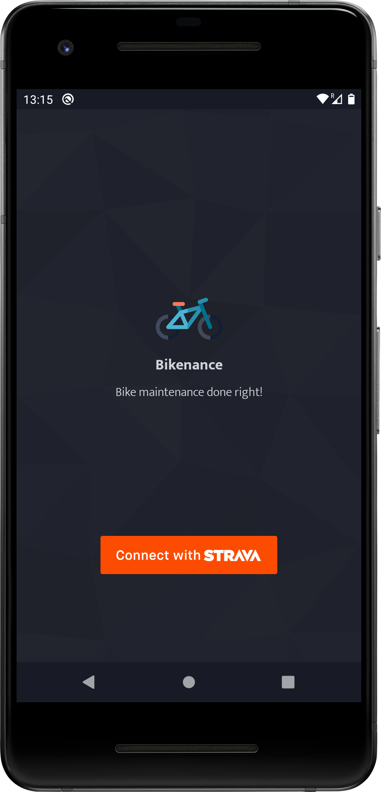
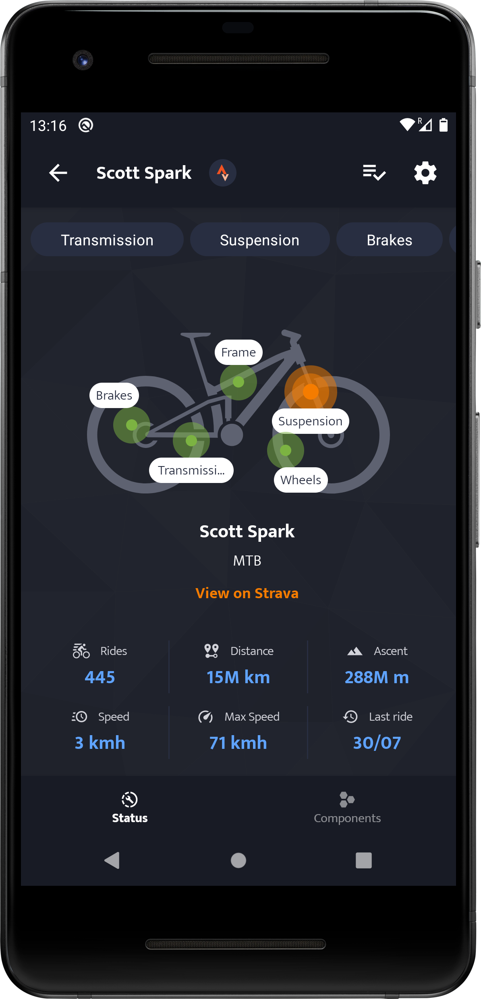
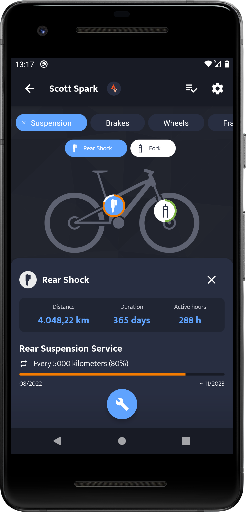

# 🚴‍ Bikenance

Bikenance is a work-in-progress Android app designed for bike enthusiasts who want to keep complete control over bike and component
maintenances. The app features integration with [Strava](https://strava.com/), a popular platform for tracking cycling activities,
enabling users to leverage their activity data for enhanced maintenance tracking.

The app relies on a [kotlin backend](https://github.com/angelpinheiro/bikenance-backend) built with the Ktor framework.

Below you can see some parts of the app that are currently being developed:

|  |  |  |  |  |  |  |  |
|:------------------------------------:|:------------------------------------:|:------------------------------------:|:------------------------------------:|:------------------------------------:|:------------------------------------:|:------------------------------------:|:------------------------------------:|

> **Bikenance is an ongoing learning project**, there may be changes or updates made at any time without prior notice.

## Key Features

- **Strava Integration**: Bikenance integrates with Strava (import user profile and user bikes, and receive new user activities). Activity
  data from Strava is used to update bike and component mileage and usage hours.

- **Component Management**: Manage the components of your bikes, such as forks, wheels, chains, etc. Record details such as the brand,
  model, and installation date for each component, and associate them with your Strava-imported bikes.

- **Maintenance Tracking**: Setup mileage-based or time-based maintenance rules for your bike components, which will be automatically
  updated with each new activity.

- **Maintenance Reminders**: Receive timely notifications and reminders when maintenance tasks or component replacements are necessary,
  calculated based on accumulated mileage and usage hours.

- **Maintenance History**: Keep a maintenance history for each component. Record
  repairs, part replacements, adjustments, and other maintenance tasks performed.

## Roadmap

### MVP Version

- Strava integration
  - Login with strava
  - Import user profile and bikes from Strava
  - Keep track of user past rides and receive new ones.
- Bike components registration.
- Basic maintenance tracking based on mileage and usage hours.
- Maintenance reminders based on accumulated mileage and usage hours.

### Future versions

- 📄 Invoice and Note Storage: Allow users to store invoices and notes related to repairs carried out
  at specialized stores.

- 📏 Biomechanical Measurements and Customizations: Provide a space to store biomechanical
  measurements, such as saddle height, handlebar distance, etc. This will facilitate bike
  adjustments in case of changes or necessary modifications.

- 🧠 Intelligent Wear Calculation
  - Utilize activity parameters from Strava to weigh component wear. These parameters may include
    terrain type, weather conditions, and activity intensity.
  - Dynamic Wear Thresholds: Over time, the app analyzes the user's maintenance history to
    determine personalized wear thresholds for each component. If a component consistently wears
    out before the initially suggested threshold, the app adjusts the threshold accordingly for
    future maintenance notifications.

### Architecture

The app employs a clean-oriented architecture with MVVM in the UI layer. Use cases are implemented only when they encapsulate
pertinent domain logic.

I try to apply an **"offline first"** approach, emphasizing the ability to access local data even when an internet
connection is unavailable. Future iterations could incorporate the option for offline remote updates.

**Tech stack**:

- Jetpack Compose for modern UI development.
- Room for local persistence
- Ktor client for remote api communication
- Hilt for Dependency Injection.
- Firebase Cloud Messaging (FCM) for delivering push notifications.

## Artwork attribution

Icons used for bike components are from
the [Mountain Bike](https://thenounproject.com/timo40/collection/mountain-bike)
collection by [Timo Nagel](https://thenounproject.com/timo40/)
at [The Noun Project ](https://thenounproject.com)

## License

Bikenance is [licensed](LICENSE.md) under
the [CC BY-NC-SA 4.0 License](https://creativecommons.org/licenses/by-nc-sa/4.0/)

