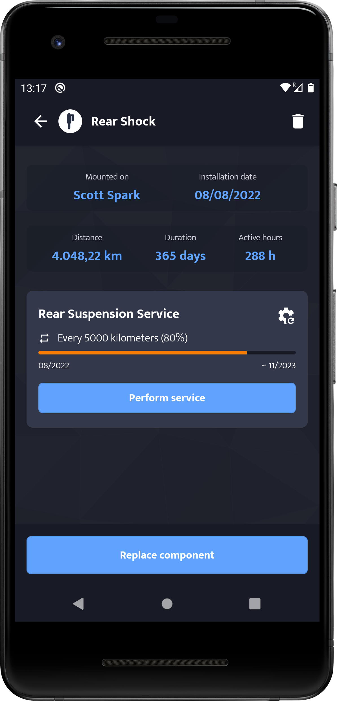

# 🚴‍ Bikenance

Bikenance is an Android app for bike enthusiasts who want to keep complete control over their bike maintenances.
The app features integration with [Strava](https://strava.com/), a popular platform for tracking cycling activities,
enabling users to leverage their activity data for enhanced maintenance tracking. The app relies on
a [kotlin backend](https://github.com/angelpinheiro/bikenance-backend) built with the Ktor framework.

> **Bikenance is an ongoing learning project**, there may be changes or updates made at any time without prior notice.

## Features

- **Strava Integration**: Connect your Strava account to import your user profile and bikes. Stay updated with new activity information. The
  app uses Strava activity data to keep track of mileage and usage hours for your bikes and components.

- **Component Management**: Easily add or remove bike components. Keep a record of when each component was installed and link them to your
  Strava-imported bikes.

- **Maintenance Tracking**: Set up maintenance rules based on mileage or time intervals for your bike components. The app will automatically
  adjust these rules with each new activity you undertake.

- **Maintenance Reminders**: Receive timely notifications and reminders for maintenance tasks and component replacements.

- **Maintenance History**: Maintain a detailed history for each component's maintenance. Keep track of repairs, part replacements,
  adjustments, and other tasks performed on your bike.

## UI

Bikenance UI is powered by Jetpack Compose, and I personally crafted the app's design. Below you can see some parts of the app that are
currently being developed:

|  |  |  |  |   |
|:------------------------------------:|:------------------------------------:|:------------------------------------:|:------------------------------------:|:-------------------------------------:|
|  |  |  |  |  |

## Architecture

The app is built upon the Clean Architecture philosophy, emphasizing a pragmatic approach, which means avoiding
overengineering while integrating essential principles of clean and modular design. The UI layer adheres to the MVVM (Model-View-ViewModel)
pattern.

The design follows an **"offline first"** approach, emphasizing the ability to access local data even when an internet
connection is unavailable. Future iterations could incorporate the option for offline remote updates.

#### Tech stack

- Jetpack Compose for modern UI development.
- Room for local persistence
- Ktor client for remote api communication
- Hilt for Dependency Injection.
- Firebase Cloud Messaging (FCM) for delivering push notifications.

The app relies on a [kotlin backend](https://github.com/angelpinheiro/bikenance-backend) built with the Ktor framework.

## Future development lines

- 📄 Invoice and Note Storage: Allow users to store invoices and notes related to repairs carried out
  at specialized stores.

- 📏 Biomechanical Measurements and Customizations: Provide a space to store biomechanical
  measurements, such as saddle height, handlebar distance, etc. This will facilitate bike
  adjustments in case of changes or necessary modifications.

- 🧠 Intelligent Wear Calculation
  - Utilize activity parameters from Strava to weigh component wear. These parameters may include
    terrain type, weather conditions, and activity intensity.
  - Dynamic Wear Thresholds: Over time, the app analyzes the user's maintenance history to
    determine personalized wear thresholds for each component. If a component consistently wears
    out before the initially suggested threshold, the app adjusts the threshold accordingly for
    future maintenance notifications.

## Artwork attribution

Icons used for bike components are from
the [Mountain Bike](https://thenounproject.com/timo40/collection/mountain-bike)
collection by [Timo Nagel](https://thenounproject.com/timo40/)
at [The Noun Project ](https://thenounproject.com)

## License

Bikenance is [licensed](LICENSE.md) under
the [CC BY-NC-SA 4.0 License](https://creativecommons.org/licenses/by-nc-sa/4.0/)

